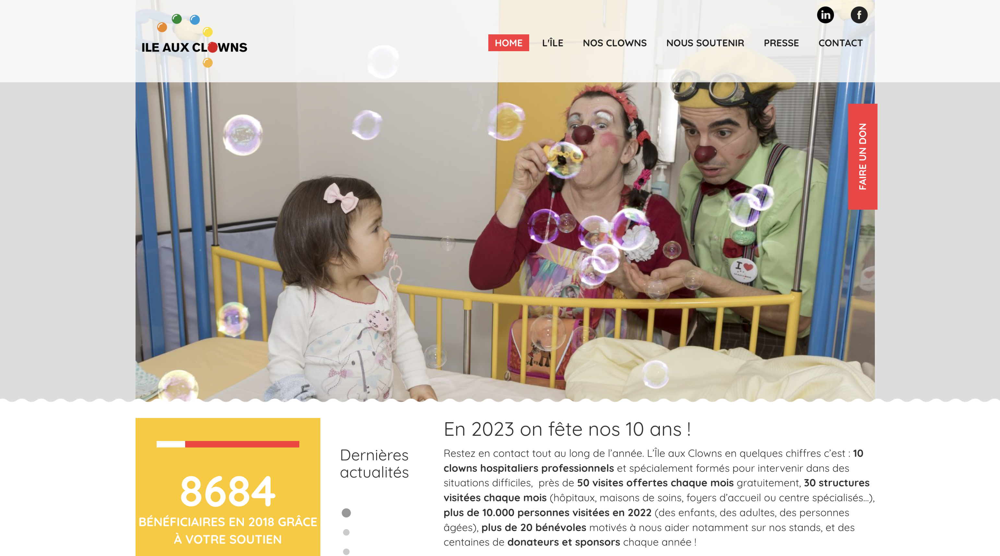
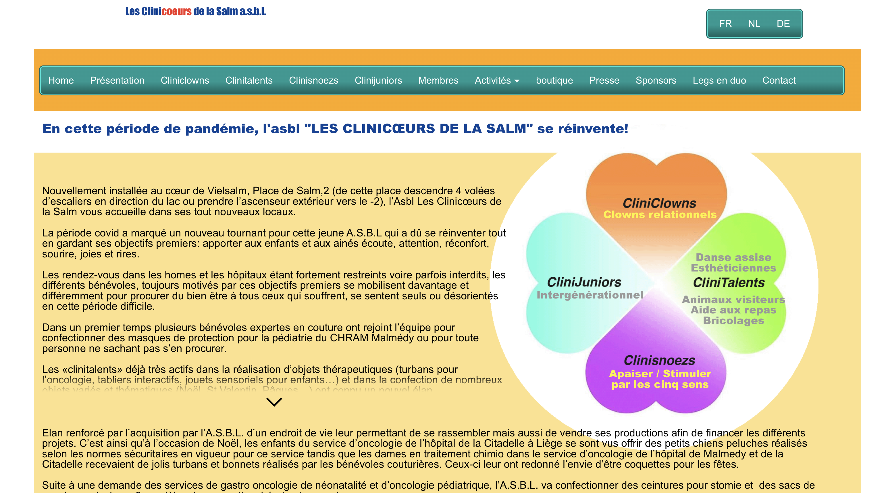
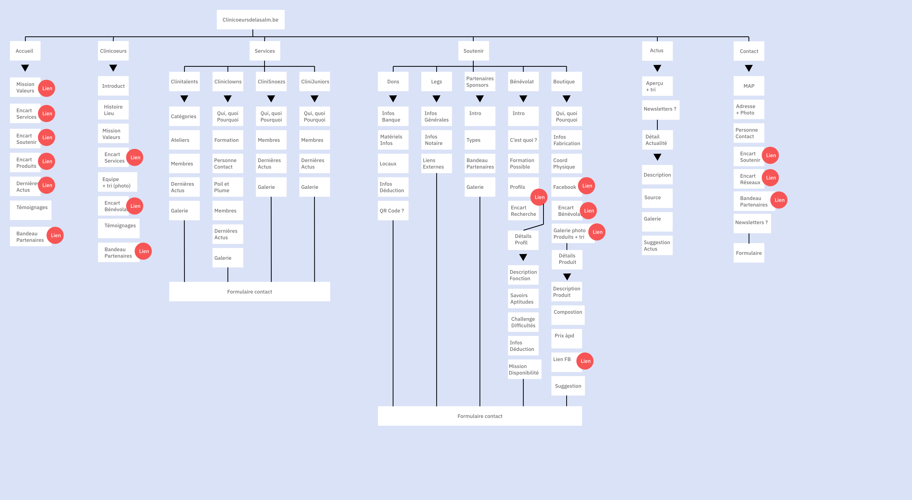

# Cahier des charges

## ASBL

### Coordonnées

Création en 2018 de l'asbl Clinicoeurs de la Salm située à Vielsam, rue des Ardoisières 19.
Téléphone 0493 71 87 37
Mail clinicoeurs@gmail.com
Compte bancaire BE59 0018 4105 2926
Membre de la fondation Roi Baudouin.

Boutique située Place de Salm 2 S21 à 6690 Vielsam (descendre quelques marches d'escalier vers le lac).
Contact boutique : Suzanne 0493 71 87 37 ou Ma Pi 0495 61 90 99 ou Facebook Titi Grosminet et Clinicoeurs de la Salm

### Valeurs

Prendre soin du bien-être des enfants, invalides et autres.
Aider les personnes indigent.

### Activités

- Rendre visite aux personnes âgées dans les maisons de repos et aux enfants dans les hôpitaux.
-> Parler et écouter, dans et animation sur place. Visite en gériatrie et autres services.

- Bricolages, couture, broderies pour la vente
-> Fabriquer des produits thérapeutiques pour les personnes malades et hôpitaux. Laisse également un cadeau à chaque chambre visitée.
- Sorties extra pour financer le tout (marché, foires, etc pour animer et vendre)

### Arguments

- Aidez nous à aider les autres
- Produits artisanaux
- Bon prix
- Service agréable

### Profil client

Client avec un coeur et qui viennent pour des produits spécifiques pour aider l'asbl.

## Concurrence

Pas l'impression de concurrence car ils offrent un service en plus avec les produits thérapeutiques et qu'ils se forment pour mieux aider.
Il y a par contre 2 boutiques proches avec des produits différents mais artisanaux.
La différence est que la vente permet de financer l'asbl ici.

## Inspiration client

### https://www.cliniclowns.be/app/francais.html = Cliniclowns

Avis client : Possibilité pour les enfants malades de contacter les cliniclowns en vidéoconférence:prendre RV. Belles photo et accent sur Nous aider.

Mon avis : Beau visuel graphique. Bonne idée les RV mais il faut avoir un téléphone ce qui n'est pas possible pour tous. Espace questions fréquentes utiles. Bannière devenir clown visible directement. Don par payconiq possible. Blog (nombreux articles variés). Fiche recrutement avec compétences requises.

### https://ileauxclowns.lu/

Avis client : Site: simple, des belles photos,demande d’aide ou dons: charger des photos peut-être payante chez nous ?  Autres photos ou idées ?

Mon avis: En effet, graphisme correct. Le carré avec le nombre de bénéficiaire est une bonne idée ! La page de présentation avec la photo des membre est top, cela permet de mettre un visage et pareil pour les clowns !

### Article de presse

Article : https://lequotidien.lu/luxembourg/les-clowns-retrouvent-le-sourire/

Avis client: Bonnes explications (peut nous aider)

### https://www.clownalfonso.be/spectacle-ecoles-clown-enfants-jeune-publics-evenements-centres-aeres.html

Avis client : belles couleurs et peut utiliser certains textes

Mon avis : TROP de couleur. Impression Carnaval et vieux blog des années 2000. C'est pas très lisible. Les textes n'ont rien de pertinent, se sont des spectacles et animations proposés avec quelques lignes d'explications. Pour avoir du texte où il y a du sens, il faut rester sur la page d'accueil.

## Site actuel client

https://www.clinicoeursdelasalm.be/index.html

Aspect un peu vieillot mais correct. Orange et bleu couleurs principales.
Explications du logo.
Beaucoup de texte, beaucoup d'item de menu.

Galeries photos pour présenter les clowns. Onglet presse. Onglet legs.

## Mots-clés

Bénévolat - Bien être - Cliniclowns - Artisanat - Social - Coeur - Aide - Soutien - Dons - Ateliers - Thérapeuthique - Lien - relation - home / maison de repos - animation - joie - clown - sens - cadeaux - recyclé - échange - respect - atelier - aîné - enfant - adulte - hôpital - Vielsam - Luxembourg - Liège -

Mots à ne pas associer au site : Profit - gratuit - concurrence

## Cible

- Tranche d'âge : 18 à 85 ans
- Profil client : Touriste et personne de la région
- Statut professionnel varié
- Profil réseaux : Beaucoup de personnes sur Facebook, pas trop sur Instagram

## Besoin de l'asbl

Recruter des bénévoles et faire connaître les produits + boutique (vente)

## Objectifs

1) Faire connaitre l'asbl à de potentiels bénévoles -> recrutement

2) Boutique -> aperçu produits et localisation

3) Informer -> but, bénévoles, produits, vente, don, leg, contact, boutique

## Stratégie

1) Faire connaitre l'asbl pour recruter des bénévoles

L'asbl dispose d'un bon réseau sur Facebook. En mettant en lien le site et leur réseau, l'asbl pourra mieux se faire connaître et attirer de nouveaux bénévoles. Il est important de bien expliquer les différents rôles de celui-ci et le context dans lequel il évoluera dans l'asbl.

Pour cela, il est d'abord primordial d'avoir une page reprenant les divers service de l'asbl : cliniclowns, clinitalents, clinisnoezs et clinijuniors avec un call to action vers la page devenir bénévole et un sur la page don.

Sur cette page devenir bénévole, un descriptif de savoir-être pour devenir bénévole sera mis en avant ainsi qu'un bref aperçu de ce qui est attendu comme tâche par celui-ci et ensuite, un formulaire dédié au bénévolat.

Sur la page don, il y aura deux parties : celle des dons classique avec compte bancaire et celle parlant des legs.

Il y aura bien entendu une page de présentation reprenant toutes les informations sur la création de l'asbl, les diverses actions, ses valeurs mais aussi ses membres et sponsors. Vu la longueur du contenu, il serait opportun de diviser cela en sous-menu pour qu'il soit plus facile à digérer et à mettre en page. De plus, quand on parle des services de l'asbl, intégrer un lien qui envoi à la page correspondante.

Concernant l'actualité et la presse, cela pourrait être réunis en une seule page avec possibilité de partager individuellement les articles qui seront catégorisés selon leur type: événement, visite, presse, ... à définir et à faire évoluer. Cela permettra le tri de ceux-ci. Grâce au partage, il y aura de l'interaction entre le site et les réseaux sociaux, l'asbl peut également partager sur sa propre page les nouveaux articles ce qui créera des visites.

Sur chaque page, il faudra veiller à avoir du contenu visuel, textuel et si besoin vidéo mais courte.

2) Boutique - aperçu des produits et localisation

Une page sera dédiées aux produits, divisés par catégories avec une fourchette de prix pour chacun.
L'adresse de la boutique et une photo de la devanture (permet de mieux localiser) ainsi qu'un aperçu Google sera mis en avant.

Il est important également d'expliquer brièvement avec un texte reprenant les mots-clés de l'asbl le but de la vente et comment ils en sont arrivés là. Soit directement sur la page, soit par une page intermédiaire (et ensuite on passe aux produits ou alors possibilités de réduire le texte).

Il y aura un formulaire de contact dédié à la boutique pour les personne souhaitant des renseignements ou pour une demande spéciale. Elle pourra venir de particuliers ou de centre médicaux.

3) Informer

Avec la page présentation, nous aurons déjà une bonne vision de l'asbl. Mais comme beaucoup ne lisent pas forcément les longs texte, il serait judicieux d'intégrer des phrases impactantes à des endroits opportuns du site.
Par exemple sur la page don "Une geste venant du coeur", sur la page des cliniclown "De la bonne humeur pour tous", ... Sans tomber dans la guimauve.

Mais aussi des phrases plus orientées et informatives comme par exemple sur la page bénévole "Volontaire pour aider" ou "Etre bénévole c'est avoir du coeur"

C'est une démarche qui prendra du temps car il faut bien choisir ses mots selon le contenu. L'ancien site peut aider très fortement car il a déjà beaucoup de texte.

## Technique

Le site doit :

- Pouvoir être multilingue (EN -FR - NL) traduit par le client -> prévoir le code et explications
- Disposer des standarts SEO
- Utiliser différents médias (photos, vidéos, API si besoin) -> attention aux droits d'auteur
- Compatible avec tous les navigateurs + version mobile
- Test d'accessibilité minimum AA, si possible AAA
- Image reponsive (optimisation, taille, ...)
- Pagination dans les pages avec beaucoup de contenu (presse/blog/actualités)
- Possibilité de filtre quand beaucoup de contenu (articles, produits)
- Utiliser Wordpress
- Contenir les RGPD et conditions générales
- La page d'accueil doit contenir un aperçu bref et visuel des pages du menu avec un call to action vers les pages ainsi que les derniers articles ajoutés.

## Graphisme

Utiliser le logo de l'asbl. Thème joyeux mais sérieux. Communiquer de la bonne humeur.

## Moodboard

[Voir le lien XD](https://xd.adobe.com/view/35ec68f4-b7f2-465d-b22f-b1061ca82726-60bf/?fullscreen)

## Structure du site

En classe, nous avons ensemble effectué un tri des cartes en se basant sur le site internet actuel.

Une proposition a alors été faite, afin que tous, ayons une bonne base.

[Voir la structure sur Miro](https://miro.com/welcome/WnN4TXBkaFFyUjZWU2ZRbUY5dHNLamN6cWthTWN5ZVpia0l3NGZZcmF2MW80N3lQVFFpNXpRMm5XMUNvNUxMbnwzNDU4NzY0NTQ2MDQzMjEzMzc1fDQ=?share_link_id=576125990948)

Pour ma part, j'ai un peu retravaillé cette proposition. En effet, je trouvais plus pertinent de mettre les contenus concernant le bénévolat dans la partie nous soutenir -> bénévolat ainsi que pour les produits vendus dans nous soutenir -> boutiques plutôt que de créer pour chacun une nouvelle page et sous-page.

La question que je me pose encore à ce stade, concerne le formulaire. Devrais-je créer un formulaire différent pour les services, soutenir et la page contact ou alors un formulaire avec du contenus qui s'affiche selon des critères de menu déroulant ?

